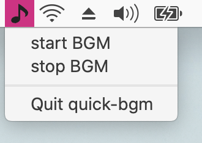
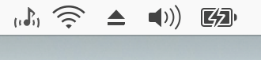

# quick BGM（仮）

macOSのメニューバーに常駐するBGMを流せるアプリ

Electronを触ってみたかったので作った Noizio や MyNoise みたいなアプリ

## 実行イメージ

メニュー



再生中のアイコン表示



## ダウンロード

Releases からダウンロード可

# 開発系

## 実行方法

cloneしてから

```
npm install
npm start
```

## やるとより良さそうに思ってること

- 音源追加
- 音量調整
- 起動時にアプリが立ち上がるようなオプション設定
- push したら自動で build される（GitHub Actions?）

## 使用したサービスなど

- mp3
    - https://soundbible.com/1664-Restaurant-Ambiance.html

- icon image
    - https://icooon-mono.com/?s=%E9%9F%B3%E7%AC%A6

- PNG to ICNS Converter
    - https://cloudconvert.com/png-to-icns
